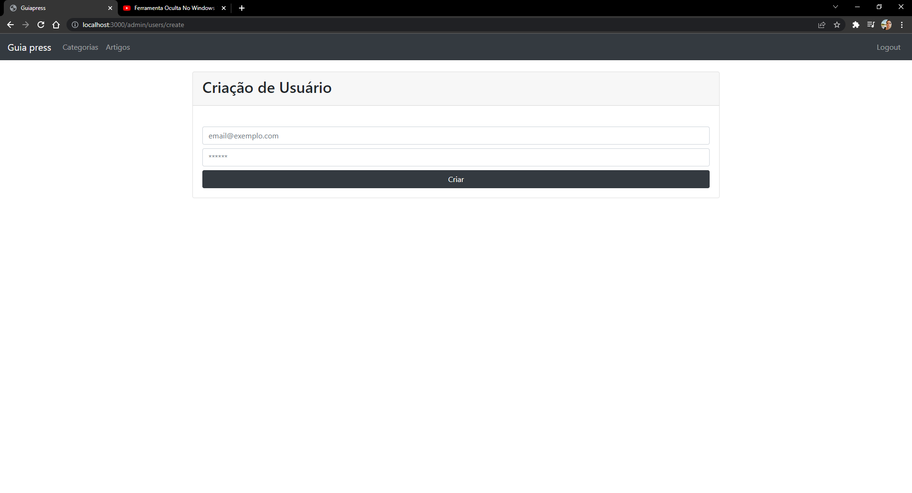

<br>




# Blog com painel administrativo e CRUD completo!!!

<p>Blog contruido usando Nodejs , com painel administrativo, sistema de login, com um editor de texto para editar os artigos.<p>

### Features

-   [x] Adicionar Artigos
-   [x] Adicionar Categotias
-   [x] Deletar Artigos
-   [x] Deletar Categorias
-   [x] Cadastro de Usuário
-   [x] Formulário de Edição
-   [x] Sistema de Paginação
-   [x] Home page com listas dos artigos por categoria ou mesclado

### Pré-requesitos

Antes de começar, você vai precisar ter instalado em sua máquina as seguintes ferramentas e bibliotecas:
[Git](https://git-scm.com), [Node.js](https://nodejs.org/en/),
Além disto é bom ter um editor para trabalhar com o código como[VSCode](https://code.visualstudio.com/).

### Instalando as Dependencias necessárias

```bash
# Clone este repositório
$ git clone <https://github.com/JhonatanNeves/blog-painel-administrativo.git>

# Instale as dependências
$ npm -i
$ npm install express --save
$ npm install nodemon -g
$ npm install ejs --save
$ npm install sequelize
$ npm install --save mysql2 "caso use o MySQL Workbench como banco de dados"
$ npm install --save bcryptjs
$ npm install express session


# Execute a aplicação
$ nodemon index.js

# O servidor iniciará na porta:3000 - acesse <https://localhost:3000>


```
